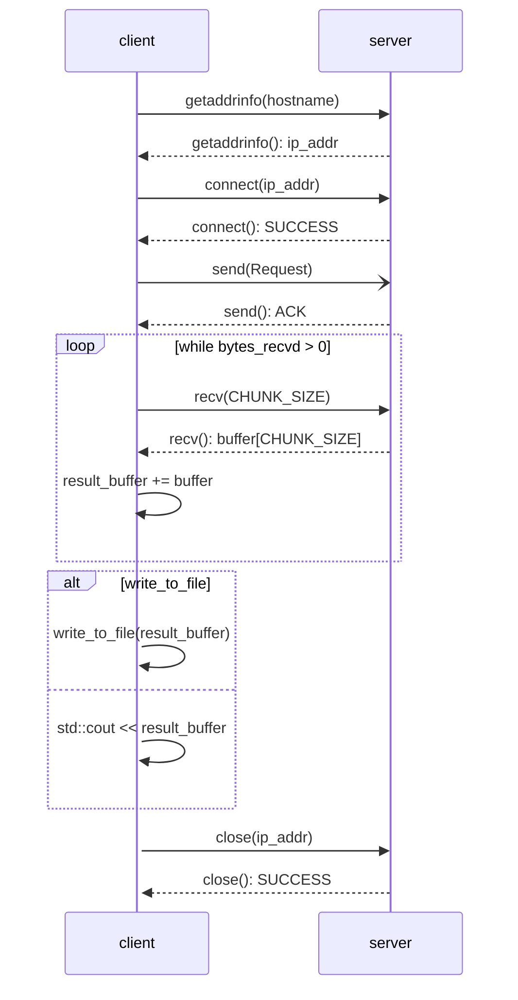

# Klassendiagramm: Struktur der Applikation
**Connection:**
- Initialisierung einer Verbindung mit einer URL
- Destruktor zum automatisierten Schließen einer Verbindung
- Abfragen von IP-Informationen des Hostname über DNS
- Durchführen eines HTTP-GET-Requests

**Request:**
- Klasse zur Initialisierung eines HTTP-Requests
- Setzen gewünschter Header-Felder

**HttpResponse:**
- Speichern empfangener HttpResponse in separaten Datenstrukturen
- Statuscode und textuelle Informationen zum HTTP-Status
- Header-Informationen
- Payload: empfangene Nutzdaten


# Sequenzdiagramm: Ablauf eines GET-Requests
- Aufbau der Verbindung über TCP
- Senden des HTTP-GET-Requests
- Empfang der HTTP-GET-HttpResponse
- Schließen der Verbindung über TCP


# Initialisierung
### ... des TCP-Sockets
```c
int fd = socket(AF_INET, SOCK_STREAM, 0);
```

### ... einer Verbindung mit dem HTTP-Server
```c++
// Structs zum Füllen der Addressinformationen
addrinfo *address_info{};
struct addrinfo hints{.ai_family = AF_UNSPEC, .ai_socktype = SOCK_STREAM};

// Auflösen der IP-Adresse
getaddrinfo("www.example.net", "http", &hints, &address_info);

// Verbinden mit dem Server
connect(fd, address_info->ai_addr, address_info->ai_addrlen);
```